# Elements Images

[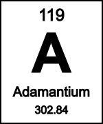](a.png)
[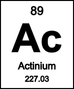](ac.png)
[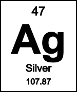](ag.png)
[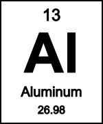](al.png)
[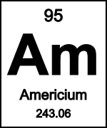](am.png)
[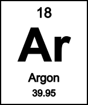](ar.png)
[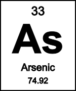](as.png)
[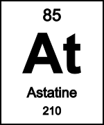](at.png)
[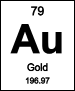](au.png)
[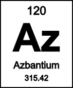](az.png)
[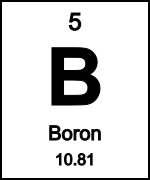](b.png)
[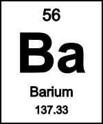](ba.png)
[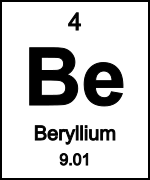](be.png)
[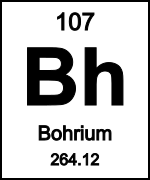](bh.png)
[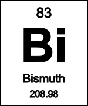](bi.png)

[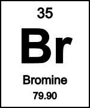](br.png)
[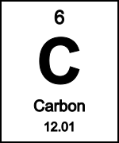](c.png)
[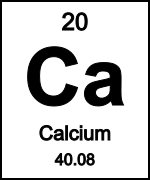](ca.png)
[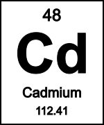](cd.png)
[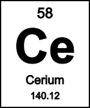](ce.png)
[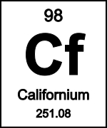](cf.png)
[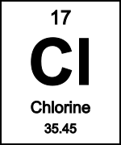](cl.png)
[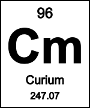](cm.png)
[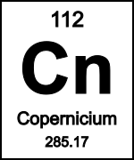](cn.png)

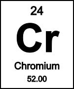
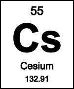

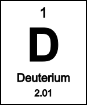
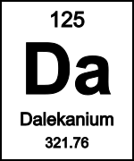
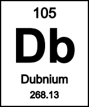
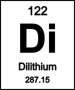
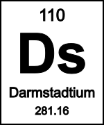
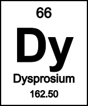
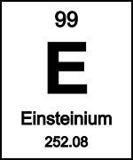
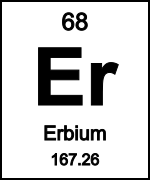
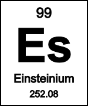
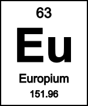
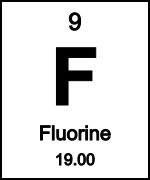
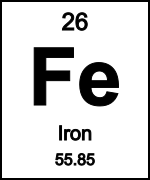
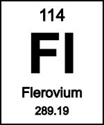

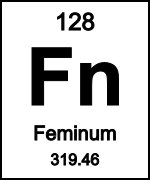
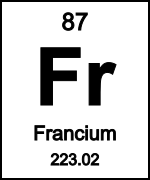
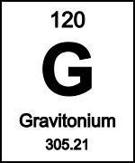
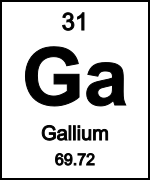
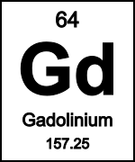
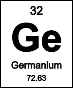
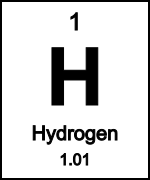
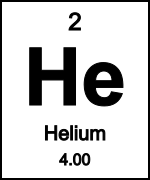
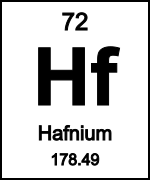

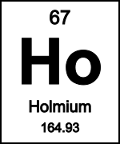

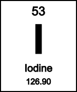
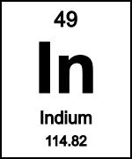
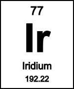
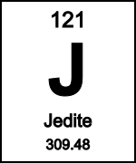
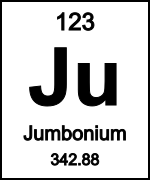
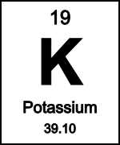
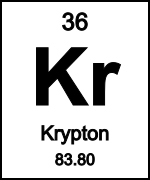
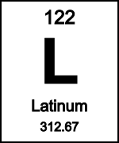
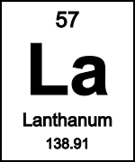
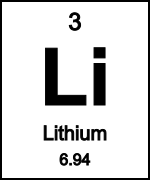
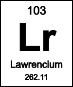
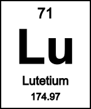
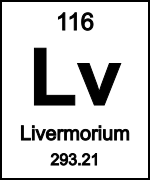
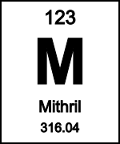

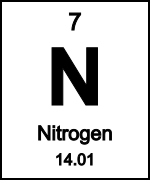
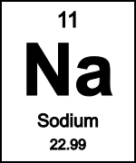
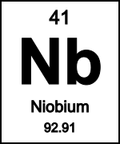
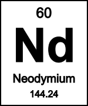
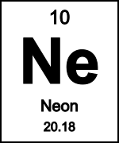
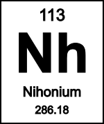
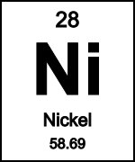
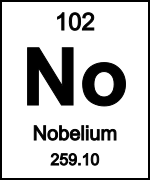
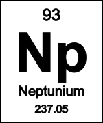
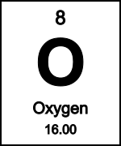
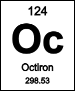
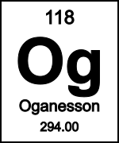
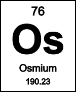
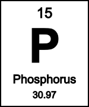
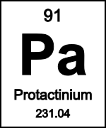

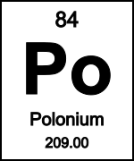

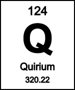
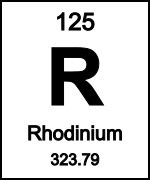
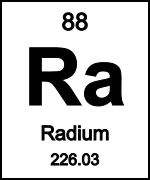
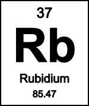
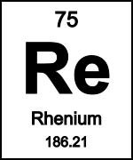
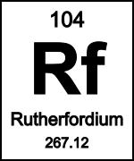
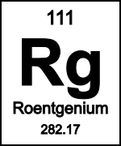
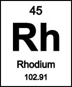
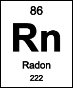
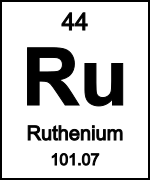
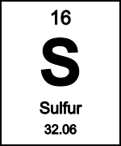
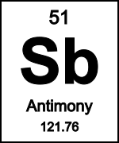

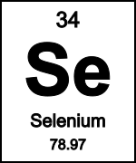

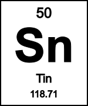

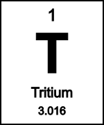

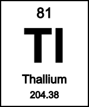

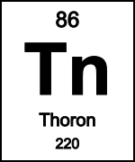

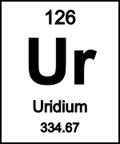
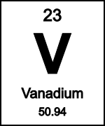
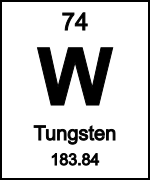
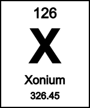
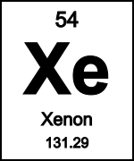
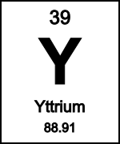
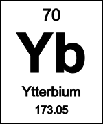
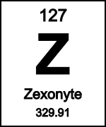
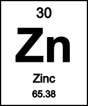
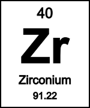
